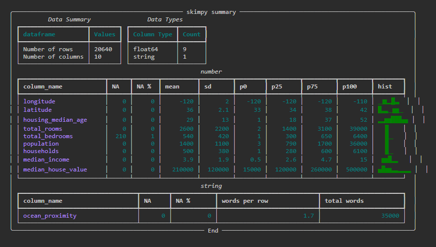
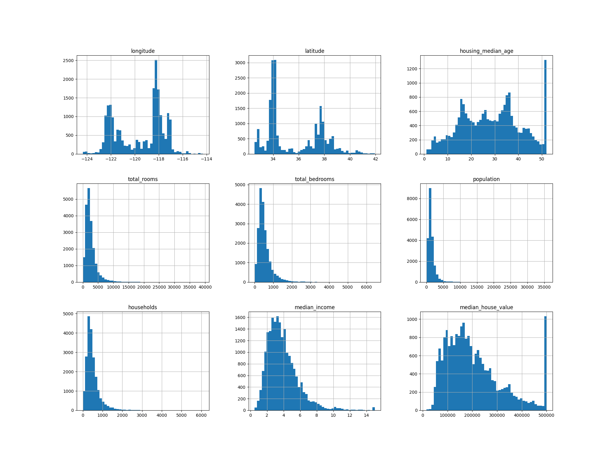
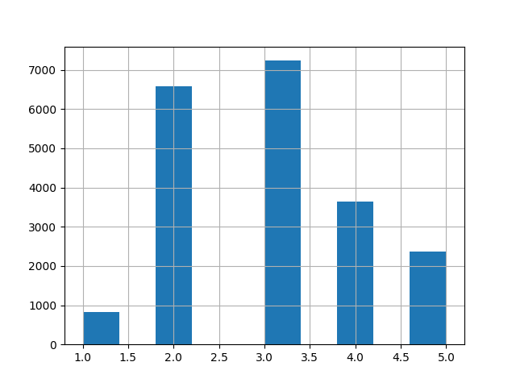
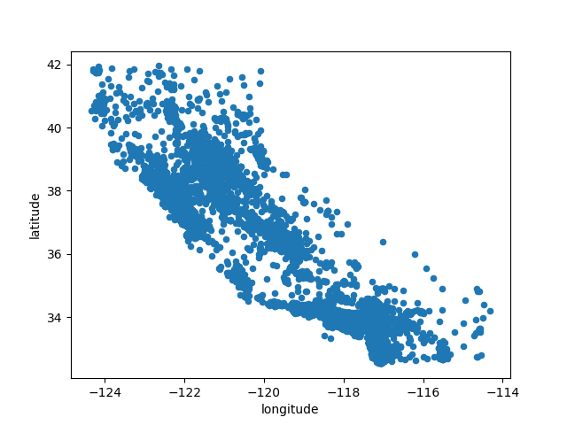
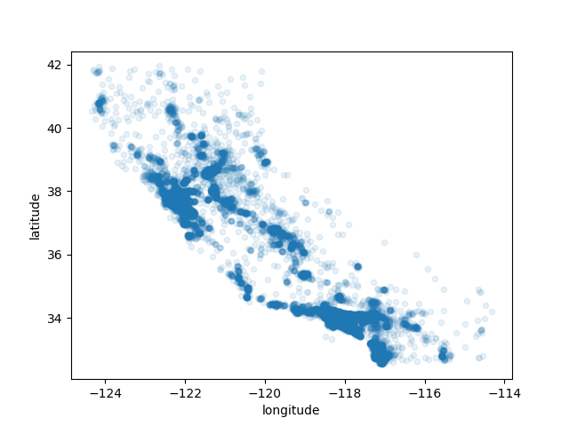
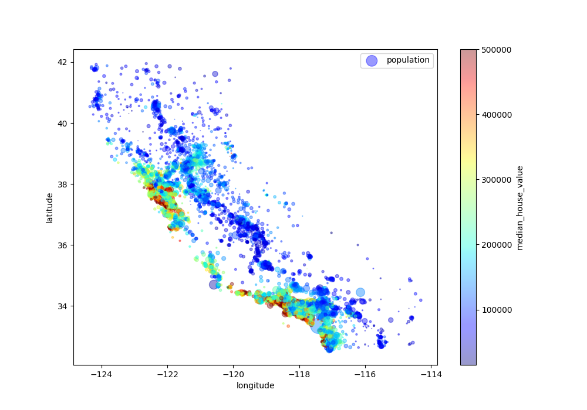
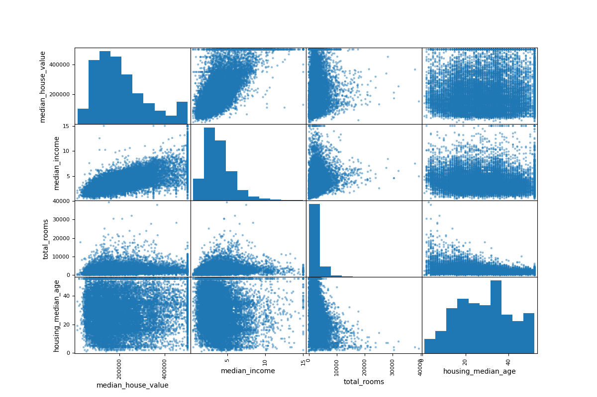
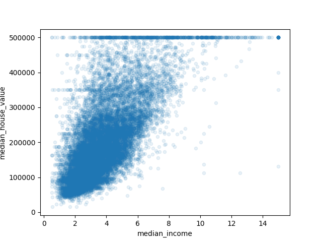

# California-Housing-Prices-model
A prediction of a district’s median housing price
## Frame the Big Picture
This model learns from the dataset provided and predicts the median housing price of each block group in California, based on many other features.
The output of this ML model will be fed to another ML system with other signals. Finally, the downstream system will decide whether it is
worth investing in a given area.
Note: getting this right is critical as it directly affects the revenue.


## Quick EDA


## Create a Test Set
In this stage, I created two sets: one for training(80%) and another for test(20%) using stratified  sampling based on the income
category. The income category is a feature built on top of median income value feature.
```python
df['income_cat'] = pd.cut(df['median_income'] , bins=[0. , 1.5 , 3.0 , 4.5 , 6.0 , np.inf]  , labels=[1,2,3,4,5])
df['income_cat'].hist()
```



This way we can ensure that the test set is representative of the various categories of incomes in
the whole dataset.

## Visualize the Data to Gain Insights






## prepare the Data for Machine Learning Algorithm
*  Data cleaning:
   In this stage we filled missing values in total_bedrooms attribute with the median value of that attribute.
   Since the median is computed on numerical attributes, we need to create another copy of the data without
   the text attribute ocean_proximity.
```python
from sklearn.impute import SimpleImputer
imputer = SimpleImputer(strategy="median")
housing_num = housing.drop("ocean_proximity", axis=1)
imputer.fit(housing_num)
```
*  Handling text and Categorical attributes:
   As data in this column is not arbitrary text; there are a limited number of possible values. ML algorithms prefer working
   with numbers, so we will convert these categories to numbers using **ordinalEncoder class**.

*  Custom Transformer:
   In this stage, we created a custom transformer for combining attributes and generating new ones(also referred to as
   **feature engineering**).
```python
from sklearn.base import BaseEstimator, TransformerMixin
import numpy as np

rooms_ix, bedrooms_ix, population_ix, households_ix = 3, 4, 5, 6

class CombinedAttributesAdder(BaseEstimator, TransformerMixin):
    def __init__(self, add_bedrooms_per_room = True): 
        self.add_bedrooms_per_room = add_bedrooms_per_room
    def fit(self, X, y=None):
        return self 
    def transform(self, X, y=None):
        rooms_per_household = X[:, rooms_ix] / X[:, households_ix]
        population_per_household = X[:, population_ix] / X[:, households_ix]
        if self.add_bedrooms_per_room:
            bedrooms_per_room = X[:, bedrooms_ix] / X[:, rooms_ix]
            return np.c_[X, rooms_per_household, population_per_household,
            bedrooms_per_room]
        else:
            return np.c_[X, rooms_per_household, population_per_household]
            attr_adder = CombinedAttributesAdder(add_bedrooms_per_room=False)
            housing_extra_attribs = attr_adder.transform(housing.values)
```
*  Feature Scaling:
   Machine Learning algorithms don’t perform well when the input numerical attributes have very different scales.
   This is the case for the housing data: the total number of rooms ranges from  about 6 to 39,320, while the median
   incomes only range from 0 to 15. Here we will use the **standardization** way to get all features have the same scale. Standardization
   is done through subtracting the mean value then dividing by the standard deviation.

*  Transformation Pipelines:
   Here we create a single transformer to handle all the columns and apply the appropriate transformations to
   each column.

## Select and Train a Model

*  Training and Evaluating on the Training Set:
   We trained the data on different ML algorithms like **linear regression**, **random forest**, **decision tree**.

*  Evaluation Using Cross-Validation:
   This method randomly splits the training set into 10 distinct subsets called folds, then it trains and evaluates
   the Decision Tree model 10 times, picking a different fold for evaluation every time and training on the other
   9 folds. After implementing this method on all ML algorithms, we chose the one that gave the least RMSE. Random forest
   model was the best to use  for our scenario

* Serializing ML models using joblib python module:
  we saved every model you experiment with so that you can come back easily to any model you want.
  we saved both the hyperparameters and the trained parameters, as well as the cross-validation
  scores and perhaps the actual predictions as well. If  we needed these models later, we would just have to
  deserialize these models and start using them.

## Fine-Tune Your Model
In this stage, we try to find out which set of hyperparameters and  values best suit the model.
```python
from sklearn.model_selection import GridSearchCV
param_grid = [
{'n_estimators': [3, 10, 30], 'max_features': [2, 4, 6, 8]},
{'bootstrap': [False], 'n_estimators': [3, 10], 'max_features': [2, 3, 4]},
]
forest_reg = RandomForestRegressor()
grid_search = GridSearchCV(forest_reg, param_grid, cv=5,
scoring='neg_mean_squared_error',
return_train_score=True)
grid_search.fit(housing_prepared, housing_labels)
```

## Evaluate the System on the Test Set
After tweaking your models for a while, you eventually have a system that performs sufficiently well.
Now is the time to evaluate the final model on the test set.
```python
final_model = grid_search.best_estimator_
X_test = strat_test_set.drop("median_house_value", axis=1)
y_test = strat_test_set["median_house_value"].copy()
X_test_prepared = full_pipeline.transform(X_test)
final_predictions = final_model.predict(X_test_prepared)
final_mse = mean_squared_error(y_test, final_predictions)
final_rmse = np.sqrt(final_mse)
```
